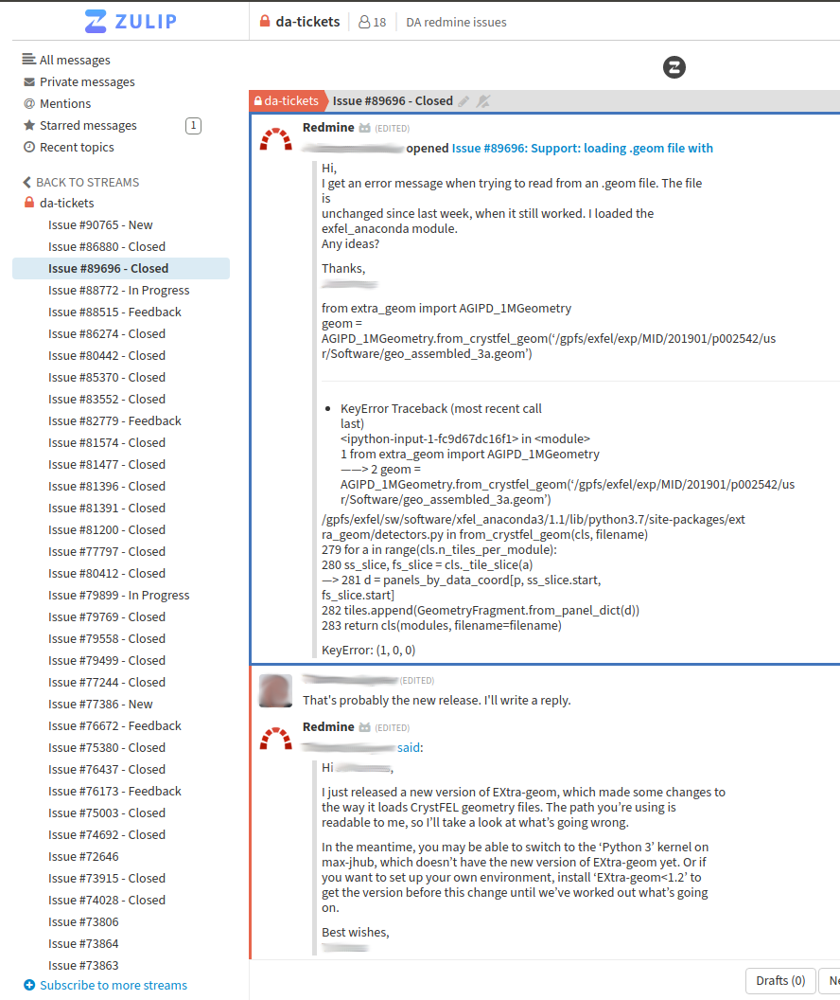

# Redmine-Zulip publisher

Simple Zulip client application for Redmine integration. This client application gets
issues from an RSS feed, publish new issues and update existing issues on Zulip.

Each issue go in a separate topic in the configured stream, making it easy to discuss
and collaborate on issues/tasks. new replies and attachments for an issue will be
published in the topic.

Example: 

# Installation

to install the package:

```bash
$ git clone https://github.com/tmichela/redmine-zulip.git
$ python3 -m pip install ./redmine-zulip
```

# Usage


```python
from redmine_zulip import Publisher
publisher = Publisher('~/configuration.toml')
# check rss url for new issues
publisher.poll()
# update existing issues
publisher.track()
```

or from the command line:

```console
redmine-zulip-publisher ~/config.toml
```

# Configuration

```toml
[DATABASE]
# sqlite3 database file
sql3_file = 'sqlite:///redmine-publisher.db'

[LOGGING]
file = 'something.log'
level = 'INFO'
rotation = 'monthly'
retention = '6 months'

[REDMINE]
# redmine url
url = 'https://in.xfel.eu/redmine'
# redmine access token
token = ''
# redmine rss feed for new tasks
rss_feed = ''

[ZULIP]
# zulip stream to publish tickets
stream = 'da-tickets'
# configuration file for the zulip bot: publish new messages
bot = ''
```
